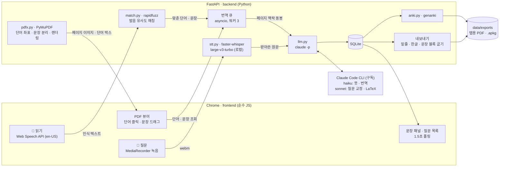

# 영한번역 — 영어 교안 예습 도구

아침에 영어 교안을 읽으면서 모르는 단어·문장을 클릭하거나 소리 내어 읽으면 한국어 뜻이 교안 위에 붙고, 끝나면 갤럭시 탭용 PDF로 내보낸다. 기획·평가는 `01-기획-평가.md`.

## 실행
```bash
./run.sh
```
브라우저(Chrome)에서 http://localhost:8766 열기. 음성 인식은 Chrome에서만 된다.

처음 한 번:
```bash
python3 -m pip install -r requirements.txt
```
번역은 `claude -p`(Claude Code 헤드리스, 구독 사용)로 한다. API 키 불필요. 단어·문장 번역 모델은 `YH_MODEL`(기본 haiku), 질문 교정 모델은 `YH_FIX_MODEL`(기본 sonnet).
질문 받아쓰기는 로컬 Whisper(`faster-whisper`). 모델은 `data/models/faster-whisper-large-v3-turbo/`에 있어야 한다. 없으면 `./scripts/download-whisper.sh`로 받는다(1.6GB, Hugging Face 자동 다운로드는 자주 멈춰서 미러 이어받기 스크립트를 쓴다). 🎤 읽기는 Chrome 내장 인식 그대로.

## 사용법
- **교안 열기**: 홈에서 PDF 선택, 과목명 입력.
- **단어 클릭** → 빨간 밑줄 + 한국어 뜻. **드래그** → 문장 번역(오른쪽 패널). **Alt+클릭** → 그 단어가 든 문장 번역.
- **🎤 읽기**: 영어로 단어나 문장을 소리 내어 읽으면 현재 페이지에서 찾아 같은 처리. (Chrome)
- **🎤 질문**: 누르고 한국어로 말한 뒤 다시 누르면 받아쓰기 → 용어·수식 정리 → 질문 목록. **전체 복사**는 질문들을 프롬프트 형태로 복사.
- **탭용 PDF 내보내기**: 밑줄·뜻·문장 번역이 박힌 PDF를 `data/exports/`에 저장.
- **Anki 덱 만들기**(홈): 조회한 단어를 과목별 `.apkg`로.
- **요약 프롬프트 복사**(홈): `prompts/요약-프롬프트.md`를 클립보드로.
- 확대·축소 ⌘+ / ⌘− / ⌘0, 페이지 이동 ← →.

## 기술 스택

| 분류 | 기술 | 버전 | 역할 |
|---|---|---|---|
| **Language** | Python | 3.13 | 백엔드 전체 |
| | JavaScript (ES2022) | — | 프런트엔드. 프레임워크·번들러 없음 |
| **Backend** | FastAPI | 0.141 | REST API, 정적 파일 서빙, 백그라운드 큐 |
| | Uvicorn | 0.54 | ASGI 서버 |
| | asyncio + ThreadPoolExecutor | stdlib | 번역 큐(워커 3), CPU 작업 분리 |
| **Frontend** | HTML / CSS / Vanilla JS | — | PDF 뷰어, 단어 박스 오버레이, 접이식 패널 |
| | Web Speech API | Chrome 내장 | 🎤 읽기 (영어 인식) |
| | MediaRecorder API | 브라우저 표준 | 🎤 질문 녹음 (webm/opus) |
| **AI / ML** | Claude Code CLI (`claude -p`) | 2.1 | LLM 호출 (구독 기반, API 키 불필요) |
| | Claude Haiku | 별칭 `haiku` | 단어 뜻, 문장 번역 |
| | Claude Sonnet | 별칭 `sonnet` | 질문 교정 (용어·LaTeX) |
| | faster-whisper (CTranslate2) | 1.2 / 4.8 | 로컬 음성 인식, 모델 large-v3-turbo int8 |
| **Document** | PyMuPDF (MuPDF) | 1.27 | PDF 파싱(단어 좌표·문장 분리), 렌더링, 주석 굽기 |
| | rapidfuzz | 3.14 | 음성 인식 결과 ↔ 페이지 텍스트 유사도 매칭 |
| | genanki | 0.13 | Anki 덱(.apkg) 생성 |
| **Data** | SQLite | 3.51 | 교안·조회·질문·단어장 (단일 파일) |
| | JSON 파일 캐시 | — | 페이지별 단어 좌표 캐시 |
| **Infra** | localhost (macOS) | — | 단일 사용자 로컬 실행, 포트 8766 |
| | Google Drive 데스크톱 | — | 내보낸 PDF를 태블릿으로 동기화 |
| **Tooling** | git, `.claude/launch.json` | — | 버전 관리, 개발 서버 자동 재시작 |

## 구조도


## 구조
```
backend/app.py     FastAPI 라우트, 번역 큐(백그라운드 2개)
backend/llm.py     claude -p 호출 (단어 뜻·문장 번역·질문 교정)
backend/pdfx.py    PyMuPDF: 단어 좌표·문장 분리·렌더링·내보내기
backend/match.py   음성 인식 결과 ↔ 페이지 단어/문장 매칭
backend/anki.py    genanki 덱 생성
backend/db.py      SQLite (data/yh.sqlite)
frontend/          index.html, app.js, style.css (빌드 없음)
prompts/           요약·예습질문 프롬프트 템플릿 (홈 복사 버튼이 읽음)
data/              업로드 PDF, 페이지 캐시, 내보낸 파일 (git 제외)
```

## 알아둘 것
- 교재처럼 줄 간격이 빽빽한 본문은 뜻을 줄 밑이 아니라 **오른쪽 여백**에 "단어 뜻" 형태로 쓴다(화면·PDF 모두). 슬라이드는 단어 밑에.
- 줄 끝 하이픈 단어("rep-" / "resent")는 클릭 한 번으로 이어서 조회된다.
- 문장 분리: 슬라이드는 줄 단위(구두점 없이 끝나고 다음 줄이 소문자로 시작하면 이어붙임), 본문은 마침표 단위.
- 한글 폰트는 TTF만 쓴다(AppleGothic / NanumGothic). Pretendard 같은 OTF는 PyMuPDF에서 글리프가 깨진다.
- 8765 포트는 다른 프로젝트 서버가 써서 8766을 쓴다.
- 교안을 다시 올리면 새 문서로 취급된다(변경 병합은 아직 없음).

## 다른 Mac에서 설치
받는 사람 쪽에 필요한 것:
1. **Python 3.10+** → `python3 -m pip install -r requirements.txt`
2. **Claude Code CLI** 설치 + 로그인(Claude 구독). 번역·교정이 `claude -p`를 부른다. 구독이 없으면 `backend/llm.py`의 `ask()`를 Anthropic API 호출로 바꾸면 된다(그 함수 하나만 쓴다).
3. **Whisper 모델** → `./scripts/download-whisper.sh` (1.6GB, 한 번만)
4. **Chrome** (🎤 읽기의 음성 인식은 Chrome 내장)
5. 실행 → `./run.sh` 또는 `./start.sh`, 브라우저에서 http://localhost:8766

한글 폰트는 macOS 기본 AppleGothic을 쓰므로 따로 설치할 것 없음. 포트가 겹치면 `run.sh`·`.claude/launch.json`의 8766을 바꾼다.
바탕화면 바로가기를 원하면 `start.sh`를 부르는 `.command` 파일을 하나 만들면 된다(아래 참고).

## 바로가기
바탕화면의 `영한번역.command`를 더블클릭하면 서버를 띄우고 Chrome을 연다(이미 떠 있으면 Chrome만). 터미널 창을 닫으면 서버가 꺼진다. 실체는 `start.sh`.
