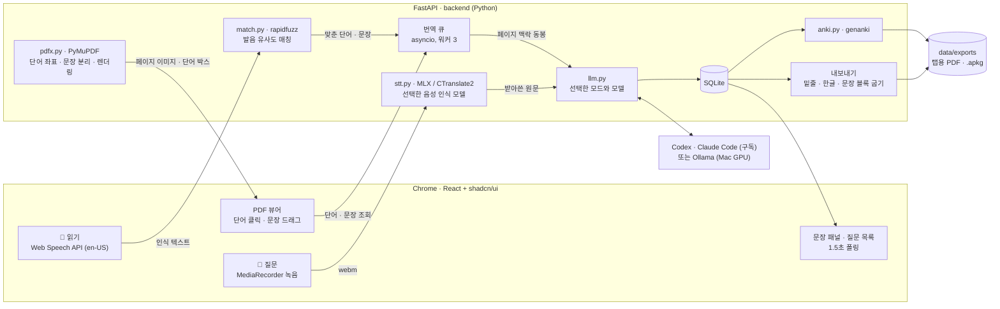

# 영한번역 — 영어 교안 예습 도구

아침에 영어 교안을 읽으면서 모르는 단어·문장을 클릭하거나 소리 내어 읽으면 한국어 뜻이 교안 위에 붙고, 끝나면 갤럭시 탭용 PDF로 내보낸다. 기획·평가는 `01-기획-평가.md`.

## 실행
```bash
./run.sh
```
브라우저에서 http://localhost:8766 열기. 영어 읽기 인식에는 Chrome을 사용한다.

처음 한 번(Python 3.12+, Node.js 24 LTS, pnpm):
```bash
python3 -m venv .venv
.venv/bin/python -m pip install -r requirements.txt
pnpm --dir web install --frozen-lockfile
```
`run.sh`는 React 화면을 빌드한 뒤 FastAPI를 실행한다. 일반 실행에서는 코드 변경으로 서버가 재시작되지 않는다. 백엔드 개발 때만 `YH_DEV=1 ./run.sh`로 자동 재시작을 켠다. 화면 개발 중에는 서버를 켜둔 상태에서 `pnpm --dir web dev`로 Vite 개발 서버(5173)를 사용할 수 있다.
화면 상단의 모델 버튼을 열어 **Codex (ChatGPT 구독)** / **로컬 (Mac GPU)** / **Claude Code (Claude 구독)** 모드와 모델을 고른다.
- **Codex**: 설치된 Codex CLI의 ChatGPT 로그인을 사용한다(`codex login`). 기본 모델은 `gpt-6-sol`, 모델 목록은 로그인 계정에서 조회한다. API 키는 사용하지 않으며 구독 사용 한도가 적용된다.
- **Claude Code**: `claude auth login`으로 구독 계정에 로그인한다. 모델과 추론 수준은 설치된 Claude CLI가 제공하는 목록을 사용한다.
- **로컬**: Ollama의 Apple Metal GPU로 실행한다. 기본 모델은 `qwen3.5:9b`(Q4, 약 6.6GB). 처음 한 번 `./scripts/setup-local.sh`를 실행하면 Ollama 설치, 서버 시작, 모델 다운로드와 GPU 확인까지 한다. Homebrew 또는 Ollama가 필요하다. 이후 Ollama가 꺼져 있으면 같은 스크립트를 다시 실행한다.
- **추론 수준**: 선택한 모델이 실제로 지원하는 값만 표시한다. Codex/Claude는 CLI의 모델 목록, 로컬은 Ollama의 모델 정보를 사용한다. `모델 기본`은 실행기의 기본값을 사용한다. Qwen3.5는 켜기/끄기, GPT-OSS는 low/medium/high처럼 모델에 따라 다르다.
- **Codex Fast**: 지원 모델에서만 선택할 수 있다. 응답 속도를 높이는 대신 구독 사용량이 더 소모되며 기본은 꺼짐이다. 추론 수준과 Fast도 요청 시작 시 고정되어 캐시에 구분된다.
- **모델 다운로드**: 사이드바의 `모델 관리`를 열고 이름 검색 → 크기·양자화 버전 선택 → 다운로드. 설치된 모델 영역에서 받은 용량·전체 용량·진행률을 표시하며 완료하면 모델 목록을 갱신한다. 완료·실패 카드는 X로 닫을 수 있으며 모델 파일은 유지된다. 음성 인식 탭도 같은 방식이다. Ollama 모델은 `~/.ollama/models`에 저장한다. 브라우저를 닫아도 서버가 실행 중이면 다운로드는 계속된다. 앱 서버를 재시작했다면 같은 모델을 다시 다운로드하여 이어받을 수 있다.
- **설치 모델 관리**: 같은 창에서 Ollama에 설치된 전체 모델과 크기를 확인하고 삭제할 수 있다. 이 앱 밖에서 받은 모델도 표시한다.
- **메모리 적합도**: Apple Silicon의 실제 RAM을 자동 감지해 설치된 모델과 다운로드 버전마다 초록·주황·빨강 상태점으로 표시한다. 정보가 없으면 빈 점이며, 짧은 뜻은 툴팁과 접근성 라벨로 제공한다. 계산식·출처·긴 안내문은 기본 화면에 노출하지 않는다. 모델 선택·다운로드를 강제로 막지는 않는다.
  - [Jan의 공개 Apple Silicon 계산식](https://github.com/janhq/jan/blob/616ca7210d1350d68a56536d57fd0f23691684a7/web-app/src/lib/modelCompatibility.ts)을 참고했다. 필요량은 `파일 크기 × (1 + 0.1 × 컨텍스트 / 4096)`, 모델용 기준은 `RAM − 2.5GiB − RAM의 10%`다. 기준의 85% 이하면 녹색, 기준 이하면 노란색, 초과하면 빨간색이다.
  - 이 앱의 컨텍스트는 8,192토큰이다. 같은 모델 digest·컨텍스트로 실행 중이면 Ollama가 보고한 모델·KV·계산 버퍼 할당량으로 보정한다. 통합 메모리의 RAM과 GPU 사용량을 중복 합산하지 않는다. GPU 부분 적재는 주의 표시한다.
  - Metal 권장 작업량 초과 여부도 안내한다. 별도 패키지나 컴파일러 설치 없이 macOS 기본 기능으로 조회한다. 배지는 메모리 기준이며 속도·실행 성공 보장이나 다른 앱의 현재 점유량을 반영한 수치는 아니다. Apple Silicon 외 환경이나 크기 정보가 없으면 정보 부족으로 표시한다.
- 설정은 `data/llm-settings.json`에 저장된다. 모드 변경은 새 요청부터 적용하고, 대기 중인 번역과 진행 중인 질문은 시작할 때 선택한 엔진을 유지한다. 같은 위치를 새 모드로 다시 조회하면 화면·PDF에는 가장 최근 요청을 사용하며 이전 DB 기록은 보존한다.
- 로컬 모드는 다른 클라우드 엔진으로 자동 전환하지 않는다. GPU 상태는 상단 **새로고침**으로 확인할 수 있다. CPU만 사용한 응답은 오류로 표시한다.
- 단어 뜻은 교안에 짧게 표시하고, 전공 개념 설명은 옆 패널에 2~3문장으로 표시한다.

기본값을 바꾸려면 최초 설정 파일 생성 전에 `YH_CODEX_MODEL`, `YH_LOCAL_MODEL`, `YH_MODEL`(Claude)을 지정한다.

질문 받아쓰기는 **모델 관리 → 음성 인식**에서 별도로 설정한다. Hugging Face의 음성인식 검색 API를 사용하며, 모델의 설정과 파일 형식을 확인해 지원하는 모델만 다운로드할 수 있다. MLX Qwen3-ASR와 MLX Audio Whisper는 Mac Metal GPU, CTranslate2 Whisper는 CPU로 실행한다. 초기 후보는 Qwen3-ASR 1.7B/0.6B 8bit와 Whisper large-v3-turbo fp16이다.
- 설치할 모델의 다운로드 버튼을 누르면 받은 용량·전체 용량·진행률을 표시한다. 고정 버전의 파일 검증이 끝나야 설치 목록에 나타난다. 다운로드 완료 후 사용할 모델을 직접 선택한다.
- 언어는 자동 감지·한국어·영어 중 고르고 교안 용어 힌트를 켜거나 끌 수 있다. 녹음 시작 때의 음성 설정과 교정용 LLM 설정을 각각 고정한다. 음성은 이 Mac에서 받아쓰고, 결과 텍스트는 선택한 번역 모드로 교정한다.
- 모델은 `data/models/stt/`, 설정은 `data/stt-settings.json`에 보관한다. `YH_DATA_DIR`를 지정하면 해당 데이터 폴더를 사용한다. 선택 중인 모델은 선택을 해제한 뒤 삭제한다.
- 기존 `data/models/faster-whisper-large-v3-turbo/` 모델도 선택할 수 있다. 기존 설치 파일은 새 관리창에서 삭제하지 않는다.
- HF 다운로드는 기본적으로 공식 HTTP 전송을 사용한다(`HF_HUB_DISABLE_XET=1`). 완료된 파일은 재사용하고 실행 중 연결 재시도는 SDK가 처리한다. 앱을 재시작하면 미완료인 큰 파일은 처음부터 다시 받을 수 있다.
- 음성 모델의 상태점은 가중치와 작업 여유를 합친 단독 실행 추정이다. 녹음 길이와 동시에 실행하는 다른 모델의 메모리는 별도다.

🎤 **읽기**는 Chrome 내장 인식을 사용한다. 음성 인식 탭의 모델 선택은 **질문 받아쓰기**에 적용된다.

## 사용법
- **과목 폴더**: 메인의 `폴더 추가`에서 만들고 `교안 추가`에서 PDF와 기존 폴더를 선택한다. 폴더를 고르지 않으면 메인에 표시한다. 이전에 입력한 과목명은 같은 이름의 폴더로 이관한다.
- **교안 관리**: 교안 카드와 읽기 화면의 `⋯` 메뉴에서 이름 변경·폴더 이동·삭제를 할 수 있다. 삭제하면 앱에 보관한 교안과 번역·질문을 함께 지우며, 업로드하기 전 원본 파일은 건드리지 않는다.
- **파일 목록**: 교안과 폴더는 한 번 클릭하면 열린다. 체크박스·⌘/Ctrl 클릭·Shift 클릭 또는 빈 곳에서 사각형을 드래그해 여러 항목을 선택한다. 목록에 포커스가 있으면 ⌘/Ctrl+A로 전체 선택, Esc로 해제할 수 있다. 격자·목록 보기와 이름순·최근 추가순 정렬을 지원한다.
- **선택 항목 관리**: 우클릭과 `⋯` 메뉴에서 열기·이름 변경·이동·삭제를 한다. 선택한 교안들을 폴더 카드나 사이드바 폴더에 끌면 함께 이동한다. `내 교안` 경로에 놓으면 메인으로 이동한다. 이동은 모두 성공하거나 변경 없이 실패하며, 폴더 구조는 기존 과목 폴더 한 단계로 유지된다.
- **드래그 앤 드롭**: PDF 파일을 메인 빈 곳에 놓으면 메인에, 폴더 카드나 사이드바 폴더에 놓으면 해당 폴더에 추가한다. 폴더 안의 빈 곳에 놓으면 현재 폴더에 추가한다. 여러 파일도 순서대로 처리한다. `교안 추가` 창에 놓으면 파일만 선택되며 `교안 열기`를 눌러 등록한다.
- **폴더 삭제**: 메인과 사이드바의 폴더 `⋯` 메뉴에서 삭제한다. 확인 후 안의 모든 교안·번역·질문까지 함께 삭제한다.
- **단어 클릭** → 빨간 밑줄 + 한국어 뜻. **드래그** → 문장 번역(오른쪽 패널). **Alt+클릭** → 그 단어가 든 문장 번역.
- **PDF 보기 방식**: 상단에서 `한 페이지`와 `연속 스크롤`을 전환한다. 연속 보기에서는 TanStack Virtual이 화면 주변 페이지만 표시하며, 스크롤한 위치에 맞춰 페이지 번호와 메모 패널이 바뀐다. 선택한 보기 방식은 브라우저에 저장한다.
- **🎤 읽기**: 영어로 단어나 문장을 소리 내어 읽으면 현재 페이지에서 찾아 같은 처리. (Chrome)
- **🎤 질문**: 누르고 한국어로 말한 뒤 다시 누르면 받아쓰기 → 용어·수식 정리 → 질문 목록. **전체 복사**는 질문들을 프롬프트 형태로 복사.
- **탭용 PDF 내보내기**: 밑줄·뜻·문장 번역이 박힌 PDF를 `data/exports/`에 저장.
- **Anki 덱 내보내기**(단어장): 조회한 단어를 과목별 `.apkg`로.
- **요약 프롬프트 복사**(홈): `prompts/요약-프롬프트.md`를 클립보드로.
- 확대·축소 ⌘+ / ⌘− / ⌘0, 페이지 이동 ← →. 연속 보기에서 Page Up / Page Down은 화면 단위로 스크롤한다.

## 기술 스택

| 분류 | 기술 | 버전 | 역할 |
|---|---|---|---|
| **Language** | Python | 3.13 | 백엔드 전체 |
| | TypeScript | 6 | 프런트엔드 |
| **Backend** | FastAPI | 0.141 | REST API, 정적 파일 서빙, 백그라운드 큐 |
| | Uvicorn | 0.54 | ASGI 서버 |
| | asyncio + ThreadPoolExecutor | stdlib | 번역 큐(워커 3), CPU 작업 분리 |
| **Frontend** | React / Vite | 19 / 8 | PDF 뷰어, 상태 관리, 빌드 |
| | shadcn/ui / Base UI / Tailwind CSS | CLI 4 / 1 / 4 | 공식 생성 컴포넌트, custom select·sheet·sidebar·분할 패널 |
| | Web Speech API | Chrome 내장 | 🎤 읽기 (영어 인식) |
| | MediaRecorder API | 브라우저 표준 | 🎤 질문 녹음 (webm/opus) |
| **AI / ML** | Codex CLI (`codex exec`) | — | ChatGPT 구독으로 단어 뜻·번역·질문 교정 |
| | Claude Code CLI (`claude -p`) | — | Claude 구독으로 번역·교정 |
| | Ollama / Metal | — | 로컬 모델 GPU 추론, 기본 Qwen3.5 9B |
| | MLX Audio / faster-whisper | 0.5.7 / 1.2 | 선택한 Qwen3-ASR·Whisper 모델로 로컬 음성 인식 |
| **Document** | PyMuPDF (MuPDF) | 1.27 | PDF 파싱(단어 좌표·문장 분리), 렌더링, 주석 굽기 |
| | rapidfuzz | 3.14 | 음성 인식 결과 ↔ 페이지 텍스트 유사도 매칭 |
| | genanki | 0.13 | Anki 덱(.apkg) 생성 |
| **Data** | SQLite | 3.51 | 교안·조회·질문·단어장 (단일 파일) |
| | JSON 파일 캐시 | — | 페이지별 단어 좌표 캐시 |
| **Infra** | localhost (macOS) | — | 단일 사용자 로컬 실행, 포트 8766 |
| | Google Drive 데스크톱 | — | 내보낸 PDF를 태블릿으로 동기화 |
| **Tooling** | git, `.claude/launch.json` | — | 버전 관리, 개발 서버 자동 재시작 |

## 구조도


## 구조
```
backend/app.py     FastAPI 라우트, 모델 설정, 번역 큐(백그라운드 3개)
backend/llm.py     엔진·모델·추론/Fast 설정, Codex/Ollama 호출, 로컬 GPU 확인
backend/claude_cli.py  Claude 구독 호출, 모델별 지원 추론 수준 조회
backend/local_models.py  공식 Ollama 모델 검색·다운로드 진행 상태
backend/model_fit.py  Mac RAM·Metal 정보, Jan 기준 메모리 판정·실행 중 보정
backend/speech_models.py  음성 모델 검색·설치·설정·삭제
backend/stt.py     선택한 로컬 음성 모델로 질문 받아쓰기
backend/pdfx.py    PyMuPDF: 단어 좌표·문장 분리·렌더링·내보내기
backend/match.py   음성 인식 결과 ↔ 페이지 단어/문장 매칭
backend/anki.py    genanki 덱 생성
backend/db.py      SQLite (data/yh.sqlite)
web/src/           React 화면·PDF 오버레이·녹음 hook
web/src/components/Reader.tsx  리더 도구 모음·확대·보기 방식·음성 상태
web/src/components/PdfViewer.tsx  TanStack Virtual 페이지 가상화·메타 로딩
web/src/components/ui/  shadcn 공식 CLI 생성 컴포넌트
web/dist/          Vite 빌드 결과 (FastAPI가 제공, git 제외)
prompts/           요약·예습질문 프롬프트 템플릿 (홈 복사 버튼이 읽음)
data/              업로드 PDF, 페이지 캐시, 내보낸 파일 (git 제외)
```

## 알아둘 것
- 교재처럼 줄 간격이 빽빽한 본문은 뜻을 줄 밑이 아니라 **오른쪽 여백**에 "단어 뜻" 형태로 쓴다(화면·PDF 모두). 슬라이드는 단어 밑에.
- 줄 끝 하이픈 단어("rep-" / "resent")는 클릭 한 번으로 이어서 조회된다.
- 문장 분리: 슬라이드는 줄 단위(구두점 없이 끝나고 다음 줄이 소문자로 시작하면 이어붙임), 본문은 마침표 단위.
- 한글 폰트는 TTF만 쓴다(AppleGothic / NanumGothic). Pretendard 같은 OTF는 PyMuPDF에서 글리프가 깨진다.
- 교안을 다시 올리면 새 문서로 취급된다(변경 병합은 아직 없음).

## 다른 Mac에서 설치
받는 사람 쪽에 필요한 것:
1. **Python 3.12+** → 위의 가상환경 설치 명령 실행. `run.sh`는 `.venv`가 있으면 우선 사용한다.
2. **Codex CLI** 설치 + ChatGPT 로그인, **Claude Code** 설치 + 구독 로그인, 또는 Apple Silicon Mac에서 `./scripts/setup-local.sh` 실행. 사용할 모드 하나만 준비해도 된다.
3. **질문 받아쓰기 모델** → `모델 관리 → 음성 인식`에서 다운로드 후 선택
4. **Chrome** (🎤 읽기의 음성 인식은 Chrome 내장)
5. **Node.js 24 LTS + pnpm** 설치.
6. 실행 → `./run.sh` 또는 `./start.sh`, 브라우저에서 http://localhost:8766

화면은 앱에 포함된 Pretendard, PDF 내보내기는 macOS 기본 AppleGothic을 사용한다. 포트가 겹치면 `run.sh`·`.claude/launch.json`의 8766을 바꾼다.
바탕화면 바로가기를 원하면 `start.sh`를 부르는 `.command` 파일을 하나 만들면 된다(아래 참고).

## 바로가기
바탕화면의 `영한번역.command`를 더블클릭하면 서버를 띄우고 Chrome을 연다(이미 떠 있으면 Chrome만). 터미널 창을 닫으면 서버가 꺼진다. 실체는 `start.sh`.

## 검증

프런트엔드 코드 검사와 빌드:
```bash
pnpm --dir web lint
pnpm --dir web build
```
실제 GPU 사용 상태는 로컬 번역 실행 후 `ollama ps`로 확인한다. 로컬 실행 환경을 처음 준비하려면 `./scripts/setup-local.sh`를 사용한다.

## 프런트엔드 기반

[shadcn의 공식 Vite 설치 절차](https://ui.shadcn.com/docs/installation/vite)에 따라 CLI가 React·TypeScript·Vite·Tailwind·Base UI 설정을 생성했다. 초기 구성은 다음 명령으로 만들었고, Select/Sheet/Dialog/Sidebar/Resizable 등은 `shadcn add`로 생성했다. 버전은 `web/pnpm-lock.yaml`에 고정한다.

```bash
pnpm dlx shadcn@latest init --template vite --base base --preset nova --no-monorepo --name web --yes --no-rtl --pointer
pnpm dlx shadcn@latest add select popover tooltip sheet dialog tabs card input textarea label badge progress separator scroll-area sidebar resizable sonner switch table skeleton -c web -y
```

도메인 UI만 생성된 컴포넌트 위에 구성한다. 페이지·문서 전환 시 오래된 요청/마이크 콜백을 무시하고, 저장되지 않은 받아쓰기 원문은 브라우저에 임시 보관한다.
